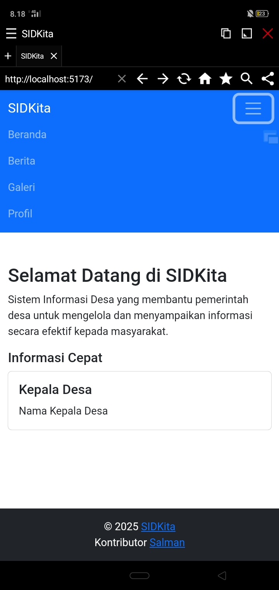

<h1 align="center">Selamat datang di SIDKita! 👋</h1>



## Apa itu SIDKita?

`SIDKita` adalah platform SID (Sistem Informasi Desa) yang dirancang untuk membantu pemerintah Desa dalam menyampaikan informasi secara efektif kepada masyarakat.

`SIDKita` sengaja dibuat Open Source agar dapat dikembangkan bersama oleh komunitas peduli SID.
Dengan proyek Open Source ini, kita dapat belajar lebih banyak tentang pentingnya kolaborasi, informasi, dan kemajuan teknologi.

Apakah _data_ aman jika Desa memiliki situs web? Jika hanya berupa informasi statis yang tidak melibatkan data sensitif, maka aman.

Membuat website SID statis memiliki beberapa kelebihan dan kekurangan yang perlu dipertimbangkan:

### Keunggulan Membuat Website SID Statis:

1. **Keamanan**:

    - Situs statis cenderung lebih aman karena tidak menyimpan atau mengolah data yang sering berubah seperti database dinamis.
    - Tidak ada kerentanan yang terkait dengan database atau CMS yang umum terjadi pada situs dinamis.

2. **Performa**:

    - Karena tidak melibatkan database atau kode server-side yang kompleks, situs statis cenderung memiliki waktu muat yang lebih cepat dan performa yang baik.

3. **Biaya**:

    - Situs statis biasanya lebih murah untuk dihosting dan dipelihara karena tidak memerlukan server yang kompleks atau banyak sumber daya.

4. **Sederhana**:

    - Mudah diatur dan dipelihara tanpa perlu pembaruan terus-menerus atau pengelolaan data yang rumit.

### Kekurangan Membuat Website SID Statis:

1. **Dinamis**:

    - Situs statis tidak dapat dengan mudah mengelola data yang sering berubah seperti formulir, pendaftaran, atau data desa yang memerlukan interaktivitas dinamis.

2. **Opsi Terbatas**:

    - Tidak ada kemampuan untuk mengelola data secara langsung melalui backend seperti input atau pengeditan data desa secara dinamis.

3. **Maintenance**:

    - Perubahan pada konten memerlukan pengeditan manual pada file-file statis, yang bisa merepotkan jika kontennya sering berubah.

### Apakah Website SID Statis Aman dan Baik?

- **Keamanan**:

    - Secara umum, situs statis memiliki tingkat keamanan yang tinggi jika dipastikan bahwa semua aset, kode, dan layanan hosting dikonfigurasi dengan baik. Namun, jika perlu mengelola data sensitif seperti data pribadi atau statistik desa yang sering berubah, maka pendekatan yang lebih dinamis menggunakan database seperti MySQL untuk menyimpan data, atau seperti dengan CMS (WordPress, Joomla, dll.) bisa lebih cocok.

- **Kebaikan**:

    - Jika hanya membutuhkan tampilan informasi desa yang tidak sering berubah, situs statis bisa menjadi pilihan yang baik, terutama untuk meningkatkan kinerja dan mengurangi biaya hosting.

Jika SID memerlukan fitur interaktif seperti pengelolaan data, formulir, atau dashboard, maka situs dinamis mungkin lebih cocok.

### Demo

> Catatan: Demo SIDKita bukan yang sebenarnya.

## Fitur Utama

1. **Beranda**: Informasi umum tentang Desa dan berita terbaru.
2. **Berita**: Menampilkan berita-berita terkini yang relevan dengan Desa.
3. **Galeri**: Koleksi foto dari kegiatan Desa.
4. **Profil**: Informasi detail tentang Desa, termasuk kepala Desa, visi, misi, dan statistik Desa.
5. **Navigasi yang Mudah**: Menu navigasi yang responsif di semua perangkat.
6. **Footer Selalu di Bawah**: Desain konsisten dengan footer di bagian bawah halaman.

## Langkah Instalasi

1. **Clone Repository**:

    ```bash
    git clone https://github.com/salmantok/SIDKita.git
    cd SIDKita
    ```

2. **Install Dependensi**:

    ```bash
    npm install
    ```

3. **Jalankan Aplikasi**:

    ```bash
    npm run dev
    ```

4. **Build untuk Produksi**:

    ```bash
    npm run build
    ```

## Struktur Navigasi

| Halaman | URL        | Deskripsi                                 |
| ------- | ---------- | ----------------------------------------- |
| Beranda | `/`        | Halaman utama dengan informasi Desa.      |
| Berita  | `/news`    | Berita terkini yang relevan dengan Desa.  |
| Galeri  | `/gallery` | Koleksi foto dari berbagai kegiatan Desa. |
| Profil  | `/profile` | Informasi umum, visi, dan misi Desa.      |

## Panduan Penggunaan

1. **Menambah Berita Baru**:

    - Buka file `src/pages/News.jsx`.
    - Tambahkan berita baru di array `newsData`:

        ```js
        const newsData = [
            {
                title: 'Judul Berita',
                date: 'Tanggal',
                content: 'Isi berita.',
            },
        ];
        ```

2. **Mengubah Data Desa**:

    - Edit file `src/pages/Profile.jsx` untuk memperbarui informasi Desa, seperti nama, kepala Desa, atau statistik.

3. **Menambah Gambar Galeri**:

    - Tambahkan item baru di array `images` di file `src/pages/Gallery.jsx`:

        ```js
        const images = [
            { src: 'URL gambar', alt: 'Deskripsi', title: 'Judul gambar' },
        ];
        ```

## Lisensi

Proyek ini dirilis di bawah **GNU General Public License (GPL)** versi 3.

Untuk informasi lebih lanjut, baca [teks lisensi lengkap](http://www.gnu.org/licenses/gpl.html).

## Donasi

[Ko-fi](https://ko-fi.com/salmantok)

## Kontributor

- **Salman**: Pengembang utama SIDKita.
